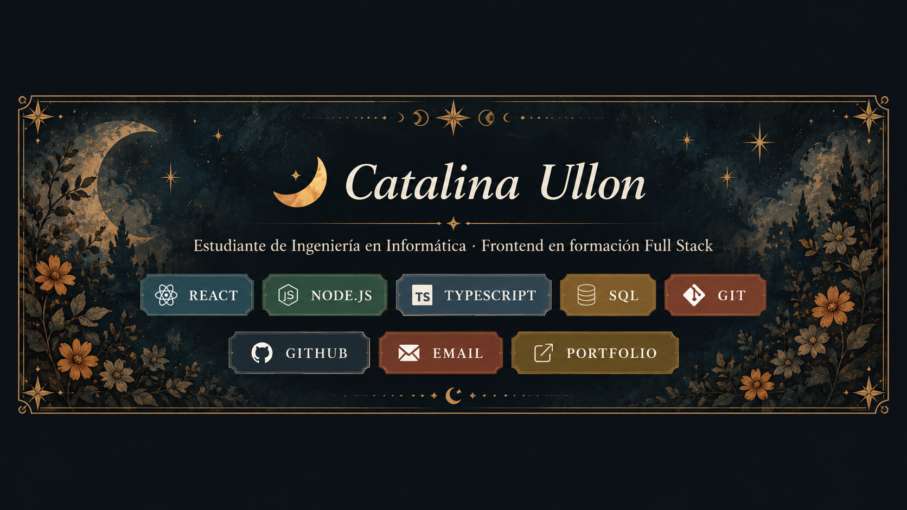
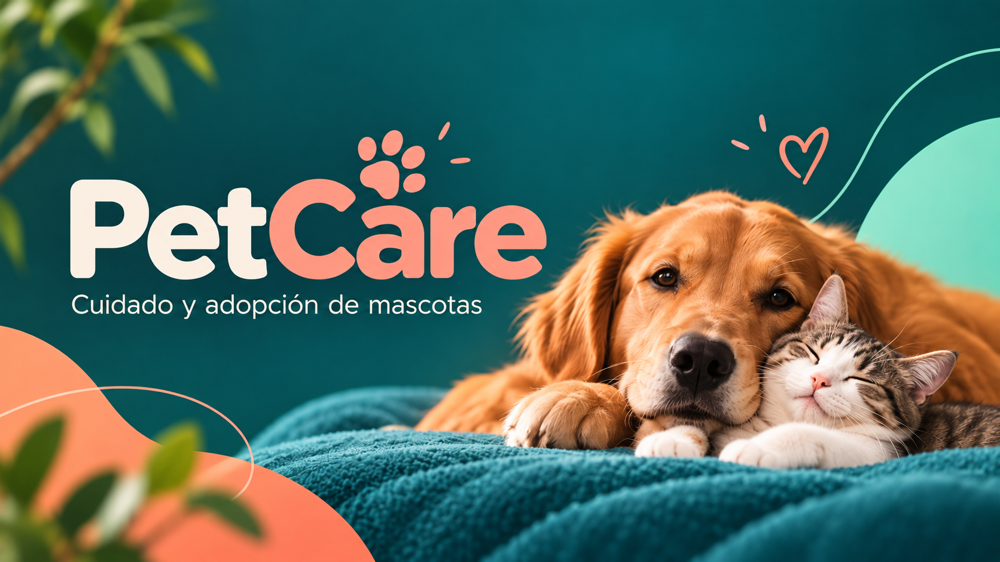

  <!-- Banner principal -->
  

  <!-- Tarjeta principal con tu información -->
  

<h2 align="center">✨ <i>Sobre mí</i></h2>

  <i>
    Soy estudiante de Ingeniería en Informática, actualmente enfocada en fortalecer mis conocimientos en desarrollo Backend y Full Stack.
  </i>

  <i>
    Me interesa especialmente trabajar con bases de datos, APIs, integración de sistemas y desarrollo de aplicaciones web.
  </i>

<h2 align="center">🌐 <i>Mi Portfolio</i></h2>

  <i>
    Tengo conocimientos básicos en HTML y CSS, y actualmente continúo fortaleciendo
    mis habilidades en desarrollo web mientras aprendo conceptos de Backend,
    APIs y bases de datos.
  </i>

  <!-- Botón visual del portfolio -->
  

<h2 align="center">📌 <i>Mis proyectos</i></h2>

<table align="center">
<tr>
<td width="50%" valign="top" align="center">

<h3>🧵 <i>HilArte</i></h3>

<!-- Imagen de HilArte -->

<i>Sitio web temático de productos artesanales desarrollado con HTML, CSS y Bootstrap.</i>

</td>

<td width="50%" valign="top" align="center">

<h3>🐾 <i>PetCare</i></h3>

<!-- Imagen de PetCare -->

<i>Proyecto académico colaborativo desarrollado para la gestión de solicitudes de adopción.</i>

</td>
</tr>
</table>

<h2 align="center">🚀 <i>Tecnologías en aprendizaje</i></h2>

  <i>Actualmente continúo fortaleciendo mis conocimientos en:</i>

<h2 align="center">🎯 <i>Objetivo profesional</i></h2>

  <i>
    Seguir desarrollando mis habilidades en programación y participar en proyectos donde pueda aplicar conocimientos de backend, bases de datos, desarrollo web e integración de sistemas.
  </i>

 

  <i>
    🌙 Aprendiendo, creando y mejorando un proyecto a la vez.
  </i>

